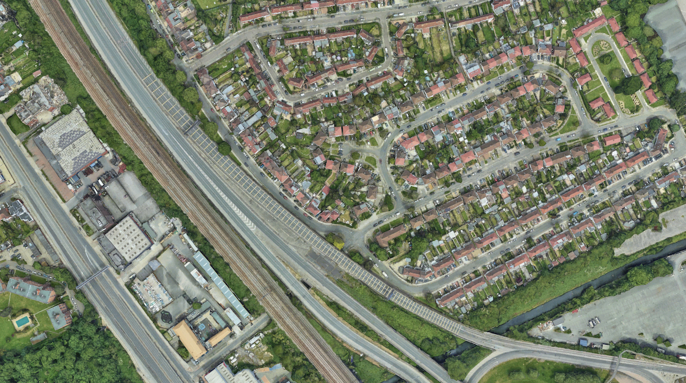

# Modelling Transverse Bars

----

 ### Mathematical Model of Transverse Bar Markings to slow down a vehicle

----

Below is a real world implementation of the problem being modelled

This is a view from [Google Earth](https://earth.google.com/web/search/Brent+Cross+Shopping+Centre,+Prince+Charles+Drive,+London/@51.57511866,-0.23056827,46.91448907a,949.13400445d,35y,-38.34416279h,43.82222061t,0r/data=CqQBGnoSdAolMHg0ODc2MTBlN2RmNDA2NjVkOjB4NjJhMDI5MGVmMDA3ZjIwMxnnlgy2x8lJQCH5tgXwu47Mvyo5QnJlbnQgQ3Jvc3MgU2hvcHBpbmcgQ2VudHJlLCBQcmluY2UgQ2hhcmxlcyBEcml2ZSwgTG9uZG9uGAEgASImCiQJHTMsqqfMSUARuN8LgBTKSUAZADO56CLFxb8hyJaA9pO4yb8) of the M1/A406 junction in North London

----

#### My Research Question

Modelling problem – Yellow lines

When one is travelling by bus or car along a major road, one often sees on the approach to a junction a succession of yellow lines painted across the carriageway. These warn the driver to slow down before reaching the junction. However, the lines are intended to do more than just warn: they are designed to encourage the driver to decelerate by creating the impression that the vehicle is going too fast otherwise.
In order to do this, the lines are positioned progressively closer together as they get nearer to the junction. Crossing the lines provides a very strong visual clue to a vehicle’s speed (and also an auditory clue, as the lines are usually painted so as to produce a click as the vehicle passes over them). If a vehicle is approaching the junction at a constant speed, then the lines come past more and more quickly, giving the driver the feeling that the vehicle is accelerating. To compensate, the driver will tend to drive so that the lines come past at a constant rate. Thus drivers can be encouraged to slow down by careful spacing of the lines.
Create a model for suggesting both the number and the spacing of the lines in order to take the greatest advantage of this effect.

----

### `functions.py` 
Contains the functions that produce the sequences and visualisations

### `transverse_bars.ipynb`
Jupyter Notebook implementing the above functions

### `Report.pdf`
Draft Modelling Report

----

#### Data from chapter 5 of the [Traffic Signs Manual](https://www.gov.uk/government/publications/traffic-signs-manual) has been converted to .csv files; `45_bars.csv` & `90_bars.csv`